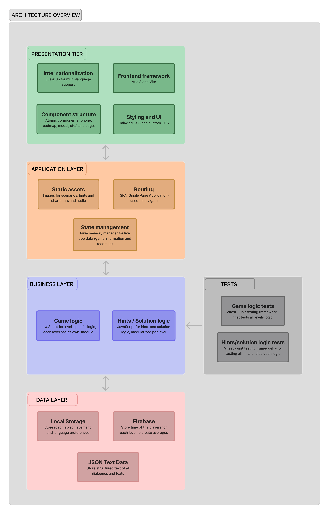
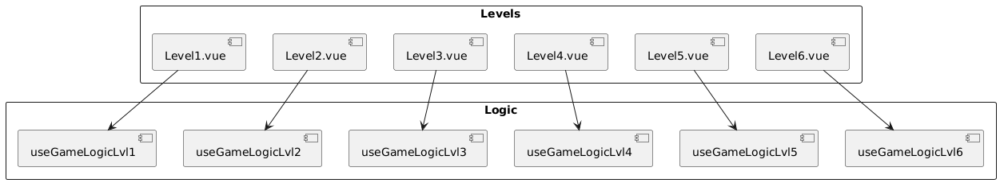
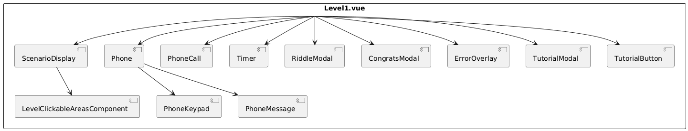

# MissionRDM - Educational Escape Game

An educational escape game built with Vue.js 3 that teaches Research Data Management (RDM) concepts through interactive gameplay. Players progress through 6 levels, solving puzzles, deciphering codes, and answering quizzes while learning about data management best practices.

## Table of Contents
1. [Project Overview](#project-overview)
2. [Architecture and Design Patterns](#architecture-and-design-patterns)
3. [Technologies Used](#technologies-used)
4. [Installation Guide](#installation-guide)
5. [Configuration Guide](#configuration-guide)
6. [Usage Guide](#usage-guide)
7. [Game Logic System](#game-logic-system)
8. [Core Systems](#core-systems)
9. [Component Architecture](#component-architecture)
10. [State Management](#state-management)
11. [Routing & Navigation](#routing--navigation)
12. [Internationalization](#internationalization)
13. [Testing](#testing)
14. [Performance and Limitations](#performance-and-limitations)
15. [Firebase Database Structure](#firebase-database-structure)
16. [Deployment](#deployment)
17. [Security](#security)
18. [Development Workflow](#development-workflow)

---

## Project Overview

MissionRDM is an educational escape game built with Vue.js 3, designed to teach Research Data Management (RDM) concepts through interactive gameplay. The application features scenarios where you have to find step-by-step codes, clickable elements and answers riddles to progressive unlock game levels.

### Key Features
- **Progressive Level System**: 6 distinct levels with different topics and challenges
- **Interactive Phone Interface**: Simulated phone keypad for code entry and character calls
- **Dynamic Hint System**: Context-aware hints and solutions with time penalties
- **Character Interactions**: Phone calls with characters providing guidance and theory
- **Time Tracking**: Timer for each level with performance tracking using Firebase
- **Multilingual Support**: English and French support with easy extensibility for more languages
- **Responsive Design**: Tailwind CSS for consistent UI across devices
- **Unit Testing**: Comprehensive test coverage using Vitest and Vue Test Utils
- **Knowledge Challenge**: Final quiz to test overall knowledge of RDM concepts

---

## Architecture and Design Patterns

### System Architecture



### Project Structure

```
MissionRDM/
├── src/
│   ├── assets/                     # Static assets
│   │   ├── audio/                  # Audio files 
│   │   ├── characters/             # Character images  
│   │   ├── en/                     # English resources
│   │   ├── fr/                     # French resources
│   │   ├── endQuiz/                # End quiz resources
│   ├── components/                 # Vue components
│   │   ├── others/                # Utility components like Congrats or TheoryResources Modals
│   │   │   ├── CongratsModalComponent.vue
│   │   │   ├── TheoryResourcesComponent.vue
│   │   │   └── ...
│   │   └── tutorial/              # Game tutorial components
│   │       ├── QuizIntroComponent.vue
│   │       └── ...
│   │   └── ...                   # Other reusable components
│   ├── logic/                     # Game business logic
│   │   └── hintsAndSolutions/     # Level-specific hint and solution logic
│   │       ├── level1/
│   │       ├── level2/
│   │       └── ...
│   │   └── level1/                 # Level 1 specific logic
│   │   └── level2/               # Level 2 specific logic  
│   │   └── ...                   # Other levels
│   ├── store/                     # Pinia stores
│   │   └── roadmap.js            # Main roadmap state store
│   │   └── gameInfo.js            # Main game state store
│   ├── pages/                     # Route components (page-level)
│   │   ├── Level1.vue
│   │   ├── Level2.vue
│   │   └── ...
│   ├── router/                    # Vue Router configuration
│   │   └── index.js
│   ├── data/                      # Json data files in french and english
│   ├── composables/               # Reusable composition functions
│   │   ├── useGameLogic.js        # Game logic composable
│   │   ├── ...
│   ├── utils/                     # Utility functions
│   │   └── gameConfig.js         # Game configuration
│   │   └── playSound.js          # Sound management utility
│   ├── App.vue                    # Root component
│   └── main.js                    # Application entry point
├── test/                          # Test files
│   └── logic/                    # Logic unit tests
│   └── store/                    # store unit tests
├── package.json                   # Project dependencies and scripts
├── vite.config.js                # Vite configuration
├── vitest.config.js              # Test configuration
└── tailwind.config.js            # Tailwind CSS configuration
```

### Class Diagrams

This diagram provides a global overview of how each level's main Vue file integrates its specific logic (e.g., useGameLogicLvl1, useGameLogicLvl2). 



This diagram shows the components hierarchy in Level 1, including reusable elements such as Phone, Timer, ScenarioDisplay, and various modals. This structure is representative of all levels, which typically use the same component building blocks adapted to their specific scenarios.



This diagram illustrates the main connections between Level 1 and Level 2 Vue files, their associated logic composables, and shared stores like useGameInfo and useRoadmapStore. The interactions shown here are applicable in the same way to other levels, which rely on equivalent composables and patterns.


---

## Technologies Used

### Main Technologies

| Purpose               | Library / Tool               |
|------------------------|------------------------------|
| Frontend Framework    | [Vue.js](https://vuejs.org/) ^3.5.13 |
| State Management      | [Pinia](https://pinia.vuejs.org/) ^3.0.2 |
| Routing               | [Vue Router](https://router.vuejs.org/) ^4.5.1 |
| Internationalization  | [Vue I18n](https://vue-i18n.intlify.dev/) ^11.1.4 |
| Styling               | [Tailwind CSS](https://tailwindcss.com/) ^3.4.17 |
| Build Tool            | [Vite](https://vitejs.dev/) ^6.3.5 |
| Firebase Integration  | [Firebase](https://firebase.google.com/) ^11.9.1 |
| Unique IDs            | [uuid](https://www.npmjs.com/package/uuid) ^11.1.0 |
| Testing               | [Vitest](https://vitest.dev/) ^3.1.4 + [Vue Test Utils](https://test-utils.vuejs.org/) ^2.4.6 |

### Dependencies

These are the main runtime dependencies (as declared in `package.json`):

```json
{
  "dependencies": {
    "firebase": "^11.9.1",
    "missionrdm": "file:",
    "pinia": "^3.0.2",
    "uuid": "^11.1.0",
    "vue": "^3.5.13",
    "vue-i18n": "^11.1.4",
    "vue-router": "^4.5.1"
  }
}
```

### System Requirements
- **Node.js**: >=18.0.0
- **npm**: >=8.0.0 (or yarn >=1.22.0)
- **Browser Support**: 
  - Chrome/Edge >=88
  - Firefox >=78
  - Safari >=14

---

## Installation Guide

### Prerequisites

- **Node.js** 18+ ([download here](https://nodejs.org/))
- **Git** 

Check if you have them:
```bash
node --version    # Should be 18+
npm --version     # Should be 8+
git --version
```

### Installation Steps

1. **Clone the project**
```bash
git clone https://github.com/jodicooli/MissionRDM.git
cd MissionRDM
```

2. **Install dependencies**
```bash
npm install
```

3. **Start development server**
```bash
npm run dev
```

4. **Open in browser**
Go to `http://localhost:5173`

### Available Scripts

```bash
npm run dev         # Development server
npm run build       # Production build
npm run preview     # Preview production build
npm run test        # Run tests
npm run test:coverage # Run tests with coverage report
```

**Having issues?**
- Make sure Node.js is 18+
- Try `npm cache clean --force` then reinstall

---

## Configuration Guide

### Firebase Configuration
To configure Firebase, you can use the '/src/services/firebase.js' file. This file contains the Firebase configuration object that is used to initialize Firebase services in the application.

### Environment Variables
You can create a `.env` file in the root directory to set environment variables of the firebase configuration. The `.env` file should look like this:

```env
VITE_FIREBASE_API_KEY=YOUR_API_KEY
VITE_FIREBASE_DOMAIN=YOUR_DOMAIN
VITE_DATABASE_URL=YOUR_DATABASE_URL
VITE_FIREBASE_PROJECT_ID=YOUR_PROJECT_ID
VITE_FIREBASE_STORAGE_BUCKET=YOUR_STORAGE_BUCKET
VITE_FIREBASE_SENDER_ID=YOUR_SENDER_ID
VITE_FIREBASE_APP_ID=1:YOUR_APP_ID
```

### Vite Configuration
Key configuration in `vite.config.js`:
```javascript
export default defineConfig({
  plugins: [vue()],
  resolve: {
    alias: {
      '@': path.resolve(__dirname, './src'),
    },
  }
})
```

---

## Usage Guide

### Starting the Game
- Open the game in your browser at `http://localhost:5173/MissionRDM`
- Follow the on-screen instructions to start the game.
- The game will guide you through the levels, providing hints and resources as needed.
- You will have to search for clickable elements, codes, solve puzzles, and answer quizzes to progress through the game.

### Game Levels
- The game consists of multiple levels, each with its own set of challenges.
- Each level has a unique set of tasks that must be completed to unlock the next level.
- You can also navigate between levels using the url `http://localhost:5173/level/X`, where `X` is the level number.

### Hints and Solutions
- Hints and solutions are provided for each level to help you progress.
- If you get stuck, you can access the hints and solutions by clicking on the hint button on the phone
- The hints will guide you towards the solution without giving it away completely.
- Hints "cost" 30 seconds of your time and solutions 60 seconds

### Quizzes
- Almost with each level, there is one or several quizzes to test your knowledge and acquire new skills.
- At the end of the whole game you can take a final quiz to test your overall knowledge of RDM concepts.

---

## Game Logic System

The game logic is primarily handled through JavaScript. Each level has its own logic files that contains the specific hints, solutions, and game mechanics for that level. 

For this especially two files are important:
- `src/logic/hintsAndSolutions/levelX/useHintsAndSolutionsLvlX.js`: Contains the logic for the hints and solutions for each level.
- `src/logic/levelX/gameLogicLvlX.js`: Contains the main game logic, including the codes, riddles and the end of a level.

### Level Progression System

Each level follows a structured progression pattern:

1. **Exploration Phase**: Players examine the scenario image for clickable elements or codes
2. **Discovery Phase**: Find hints, post-it notes, interactive objects or code
3. **Code Entry Phase**: Use the phone keypad to enter discovered codes
4. **Character Interaction**: Make or receive phone calls for guidance
5. **Problem Solving**: Apply RDM concepts to solve puzzles
6. **Completion**: Successfully complete all tasks to progress

### Character Call System

Characters can be called for:
- **Theory explanations**: RDM concept introductions
- **Practical guidance**: Gives hints on how to solve the current riddle
- **Contextual hints**: Other level-specific assistance

Call types:
- **Outgoing**: Player initiates call when character is available
- **Incoming**: Character calls player with information

---

## Core Systems

### Session Management

The session system handles player progress tracking:

```javascript
// Session creation with Firebase integration
const createGameSession = async (playerName) => {
  const sessionId = uuid()
  const firebaseSessionData = { id: sessionId }
  
  await set(ref(db, `/${sessionId}`), firebaseSessionData)
  
  session.value = { 
    id: sessionId, 
    playerName: playerName,
    startTime: Date.now() 
  }
  
  localStorage.setItem('sessionId', sessionId)
  return sessionId
}
```

### Timer and Performance Tracking

```javascript
// Level completion tracking
const saveLevelTime = async (level, timeSpent) => {
  // Save individual time
  await set(ref(db, `/${sessionId}/levels/${level}`), {
    timeSpent: timeSpent,
    completedAt: Date.now()
  })
  
  // Update global averages
  await updateAverageTime(level, timeSpent)
}
```

### Clickable Elements System

Dynamic clickable elements based on game state:

```javascript
// Conditional element visibility
const canShowElement1 = computed(() => {
  return game.level === 1 && game.currentScenarioImage === 'updated'
})

// Element interaction handler
function handleElement1Click() {
  if (!canShowElement1.value) return
  
  game.removeOverlay(game.overlayId)
  game.currentScenarioImage = 'third'
  game.riddleSolved = false
}
```

---

## Component Architecture

### Level Components Structure

Each level component follows this pattern:

```vue
<template>
  <div class="level-container">
    <!-- Scenario Display -->
    <ScenarioDisplay :currentImage="game.currentScenarioImage" />
    
    <!-- Interactive Elements -->
    <ClickableElement 
      v-if="clickables.canShowElement1" 
      @click="clickables.handleElement1Click" 
    />
    
    <!-- Phone Interface -->
    <PhoneKeypadComponent />
    
    <!-- Game UI -->
    <TimerComponent />
    <RoadmapComponent />
  </div>
</template>

<script setup>
import { useGameLogic } from '@/logic/useGameLogic'
import { useClickableElements } from '@/composables/useClickableElements'

const gameLogic = useGameLogic()
const clickables = useClickableElements()
</script>
```

### Shared Components

**PhoneKeypadComponent**: Central interaction hub
- Number pad for code entry
- Character call interface
- Hint/solution buttons with penalty system
- Status feedback display

**TimerComponent**: Performance tracking
- Real-time level timer
- Penalty system integration
- Level completion timing

**RoadmapComponent**: Progress visualization
- Step completion tracking
- Dynamic content updates
- Visual progress indicators

---

## State Management

### Game Store (`gameInfo.js`)

Primary game state management:

```javascript
const useGameInfo = defineStore('game', {
  state: () => ({
    level: 1,
    playerName: '',
    currentScenarioImage: 'default',
    enteredCodes: [],
    callableCharacters: {
      Santiago: false,
      Inès: false,
      Jack: false
    },
    overlayNotes: [],
    showCongratsModal: false,
    levelStartTime: null
  }),
  
  actions: {
    setCharCallable(charKey, value, callType = 'outgoing') {
      this.callableCharacters[charKey] = value
      this.characterCallTypes[charKey] = callType
    },
    
    showOverlay(note) {
      const id = overlayId++
      const fullNote = { ...note, id }
      this.overlayNotes.push(fullNote)
    }
  }
})
```

### Roadmap Store (`roadmap.js`)

Progress tracking:

```javascript
const useRoadmapStore = defineStore('roadmap', () => {
  const roadmapSteps = ref([
    { key: 'step1', label: '', items: [] },
    // ... other steps
  ])
  
  const addEntry = (stepKey, entryKey) => {
    const step = roadmapSteps.value.find(s => s.key === stepKey)
  }
})
```

---

## Routing & Navigation

The application uses **Vue Router** to manage navigation between screens and levels.

### Configuration

Routes are defined in `src/router/index.js`. Each route maps a URL path to a Vue component:

- `/`: Start screen
- `/introduction`: Introduction page
- `/level/1` to `/level/6`: Main game levels
- `/level/end`: End screen
- `/level/quiz`: Quiz screen

The router uses **hash mode** (`createWebHashHistory`) so URLs include `#` fragments, ensuring compatibility with static hosting (e.g., GitHub Pages).

**Example:**
```javascript
{
  path: '/level/3',
  name: 'Level3',
  component: Level3
}
```

---

## Internationalization

The application supports multiple languages using **Vue I18n**. Language files are located in `src/data/en` and `src/data/fr`, containing translations for all text in the game. 

### Additional Languages

To add a new language:

1. **Create a translation file**
   - Add a new JSON file in the `src/data` directory.
   - Name it using the language code (e.g., `de.json` for German).

2. **Add translations**
   - Use the same keys as the existing English and French files.
   - Example:
     ```json
     {
       "startScreen": {
         "title": "WILLKOMMEN ZUR MISSION RDM",
         "subtitle": "Ein Lernspiel zum Thema Forschungsdatenmanagement.",
         "enterName": "Geben Sie Ihren Namen ein:",
         "namePlaceholder": "Ihr Name",
         "startGame": "Spiel Starten",
         "tutorial": "Anleitung",
         "nameError": "Ihr Name darf nur Buchstaben und Zahlen enthalten."
       }
     }
     ```

3. **Update the language selector**
   - Open `LanguageToggleComponent.vue`.
   - Add a `<option>` for the new language code, e.g.:
     ```html
     <option value="de">🇩🇪 Deutsch</option>
     ```

4. **Update any language-dependent URLs**
   - In `TheoryResourcesComponent.vue`, check the `openPDF()` and `openExternalLink()` functions.
   - Add your language code to return the correct PDF or external link for that language.

---

## Testing

### Unit Tests

Unit tests are written using **Vitest** and are organized by feature area.

#### Test Directories

- `test/logic/`  
  Contains tests for all game logic, hints and solutions, including:
  - Level-specific logic (e.g., `useGameLogicLvl1`, `useGameLogicLvl2`, etc.)
  - Hints and solutions logic (e.g., `useHintsAndSolutionsLvl1`, `useHintsAndSolutionsLvl2`, etc.)

- `test/store/`  
  Contains tests for Pinia stores:
  - `gameInfo` store (player progress, calls, overlays)
  - `roadmap` store (unlocked steps, roadmap)

#### What is tested

Tests cover:

- **Game Logic**  
  - Routing to the correct level logic based on URL path
  - Handling code input validation
  - Scenario image updates
  - Level transitions
  - Character call logic

- **Hints and Solutions**  
  - Determining the correct hint or solution to display based on player progress

- **Stores**  
  - State management for player progress
  - Roadmap state updates

#### Running Tests

Run the following command to execute all tests:

```bash
npm run test
```

### Coverage Reports

Coverage reports can be generated to see how much of the code is covered by tests. To generate a coverage report, run:

```bash
npm run test:coverage
```

### Continuous Testing

Automated tests are run on **GitHub Actions** for every push and pull request. The workflow is defined in `.github/workflows/test.yml`.

The workflow:

1. Runs on branches: `main`, `master`, `develop`, `dev`
2. Installs dependencies
3. Runs the test suite with `npm run test:run`

This ensures all changes are validated before merging.

---

## Performance and Limitations

### Current Limitations

1. **Scalability**: Firebase Realtime Database is used for player progress tracking, which has some limitations:
   - Free tier has limited read/write operations
   - Limited data storage
   - No complex queries or aggregations
2. **Browser Storage**: Reliance on localStorage without fallback strategies
3. **Asset Loading**: No lazy loading for level-specific assets
4. **Mobile Optimization**: Limited testing on mobile devices

### Known Performance Considerations

- **Image Assets**: Large scenario images may impact load times
- **Audio Files**: No compression optimization implemented

### Optimization Recommendations

1. **Implement asset lazy loading**
2. **Add image compression pipeline**
3. **Optimize audio files for web**
4. **Use different db for larger data storage**

---

## Firebase Database Structure

Player progress and aggregated statistics are stored in **Firebase Realtime Database**.

### Document Structure

Each record is stored under a **unique UUID key**, e.g.:

```
/<database-root>/
ae1cb57e-801f-4d2b-8d25-b1b7317df8d5
```

Each record has the following fields:

| Field                            | Type      | Description                                      |
|----------------------------------|-----------|--------------------------------------------------|
| `id`                             | string    | Unique identifier (same as the record key)      |
| `levels`                         | object    | Per-level progress data                         |
| `averages`                       | object    | Aggregated statistics across all sessions       |

### Levels

The `levels` object contains numeric keys for each level.  
Each level has:

| Field             | Type    | Description                                  |
|-------------------|---------|----------------------------------------------|
| `timeSpent`       | number  | Time spent in milliseconds                  |
| `completedAt`     | number  | Timestamp                                   |

Example:

```json
"levels": {
  "1": {
    "timeSpent": 711000,
    "completedAt": 1751274750260
  }
}
```

### Averages

The `averages` object contains aggregate statistics per level:

| Field             | Type    | Description                                  |
|-------------------|---------|----------------------------------------------|
| level_<n>.count | number  | Number of players who completed this level   |
| level_<n>.totalTime | number  | Total time spent by all players on this level |
| level_<n>.average | number  | Average time spent by players on this level |

Example:

```json
"averages": {
  "level_1": {
    "count": 10,
    "totalTime": 5603000,
    "average": 560300
  }
}
```

### Example Record

```json
{
  "id": "ae1cb57e-801f-4d2b-8d25-b1b7317df8d5",
  "levels": {
    "1": {
      "timeSpent": 711000,
      "completedAt": 1751274750260
    }
  },
  "averages": {
    "level_1": {
      "count": 10,
      "totalTime": 5603000,
      "average": 560300
    }
  }
}
```

---

## Deployment

The project is deployed automatically to **GitHub Pages** using a GitHub Actions workflow. The workflow is defined in `.github/workflows/deploy.yml`.

On every push to the `main` branch:

1. The workflow installs dependencies and builds the project.
2. The static files in the `dist/` directory are published to the `gh-pages` branch.

The deployment uses:

- **peaceiris/actions-gh-pages** action to publish the build

No manual steps are required. The site is always up to date after pushing changes to `main`.

---

## Security

### Input Validation and Sanitization

The application implements several security measures to protect against common web vulnerabilities and ensure data integrity.

#### Player Name Validation

Player names are strictly validated to prevent security issues and maintain data consistency:

**Validation Rules:**
- **Allowed characters**: Letters (a-z, A-Z) and numbers (0-9) only
- **Prohibited characters**: Spaces, special characters, symbols, and Unicode characters

**Implementation:**
```javascript
// Player name validation - from StartScreen.vue
const validatePlayerName = (name) => {
  if (!name || name.trim().length === 0) {
    return false
  }
  return /^[a-zA-Z0-9]+$/.test(name.trim())
}
```

**Security Benefits:**
- **Prevents XSS attacks**: No HTML/JavaScript injection through player names
- **Maintains data integrity**: Consistent naming format across all records in case for a future database migration
- **Prevents UI breaking**: No special characters that could break display logic

#### Code Input Validation

The codes are entered through the phone keypad and so they are validated to ensure they match the expected format:
```javascript
const numbers = [1, 2, 3, 4, 5, 6, 7, 8, 9]

<div class="grid grid-cols-3 gap-2">
      <button
        v-for="num in numbers"
        :key="num"
        :disabled="gameLogic.hasPendingCall()"
        class="py-3 rounded-lg text-lg font-bold transition-colors"
        :class="[
          gameLogic.hasPendingCall() 
            ? 'bg-gray-700 text-gray-500 cursor-not-allowed' 
            : 'bg-gray-800 hover:bg-gray-700 text-white'
        ]"
        @click="appendNumber(num)"
      >
        {{ num }}
      </button>
    </div>
```

### Firebase Configuration and GitHub secrets

The application uses Firebase with default security settings for data storage. The default rules are set to allow read/write access. The Firebase secrets are stored in GitHub Secrets and are not exposed in the codebase. Firebase security rules can be configured in the Firebase console to restrict database access as needed.

The GitHub Secrets are used to store the Firebase configuration variables securely. The secrets are defined in the GitHub repository settings. For the deployment it accesses the Firebase configuration from the GitHub Secrets:
```yaml
    - name: Build
      run: npm run build
      env:
        VITE_FIREBASE_API_KEY: ${{ secrets.VITE_FIREBASE_API_KEY }}
        VITE_FIREBASE_DOMAIN: ${{ secrets.VITE_FIREBASE_DOMAIN }}
        VITE_DATABASE_URL: ${{ secrets.VITE_DATABASE_URL }}
        VITE_FIREBASE_PROJECT_ID: ${{ secrets.VITE_FIREBASE_PROJECT_ID }}
        VITE_FIREBASE_STORAGE_BUCKET: ${{ secrets.VITE_FIREBASE_STORAGE_BUCKET }}
        VITE_FIREBASE_SENDER_ID: ${{ secrets.VITE_FIREBASE_SENDER_ID }}
        VITE_FIREBASE_APP_ID: ${{ secrets.VITE_FIREBASE_APP_ID }}
```

### Data Privacy and Protection

#### Session Management
- **Unique session IDs**: Each game session uses a UUID
- **No personal data storage**: Only UUID and game performance data are stored

#### Local Storage Security
- **Non-sensitive data only**: Only playername and game progress stored locally
- **No authentication tokens**: No sensitive authentication data in browser storage

### Security Best Practices Implemented

1. **Input Sanitization**: All user inputs are validated and sanitized
2. **Content Security Policy**: Prevent unauthorized script execution
3. **HTTPS Only**: All production deployments use HTTPS (GitHub Pages)
4. **Dependency Security**: Most recent versions of dependencies used
5. **Error Handling**: No sensitive information exposed in error messages

### Recommended Improvements
1. **Add server-side validation** for critical operations
2. **Implement Firebase security rules** to restrict database access

---

## Development Workflow

### Getting Started for New Developers

1. **Repository Setup**:
```bash
git clone https://github.com/jodicooli/MissionRDM.git
cd MissionRDM
npm install
```

2. **Environment Configuration**:
   - Create a `.env` file in the root directory that has the same structure as the .env.example file.
   - Add Firebase credentials (contact @Jodicooli for access or create a new Firebase realtime database)

3. **Development Process**:
   - Create feature branch
   - Make changes and test locally
   - Run tests
   - Create pull request

### Code Style Guidelines

- Reuse the modals and components
- Write descriptive commit messages
- Add comments for all logical blocks
- Test new features with unit tests

### Adding New Levels

1. **Create level logic**: `src/logic/level7/gameLogicLvl7.js`
2. **Add hint system**: `src/logic/hintsAndSolutions/level7/useHintsSolutionsLvl7.js`
3. **Create Vue component**: `src/pages/Level7.vue`
4. **Update router**: Add route in `src/router/index.js`
5. **Add translations**: Update language files
6. **Write tests**: Create test files for new logic

### Branching strategy

 A simplified Git Flow strategy is used: The main branch served as the production branch and is published through GitHub Pages. There is also a dev branch for ongoing development. Separate feature branches are created for individual levels, for instance "lvl2" or "lvl3", in order to work specifically on certain sections without endangering the stability of the main project.

---

*This README provides comprehensive documentation for the MissionRDM educational escape game. For questions, please contact @Jodicooli on GitHub.*